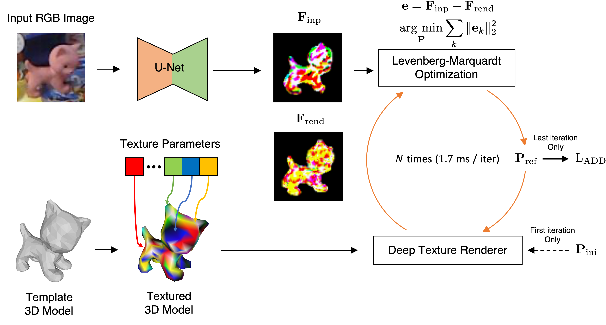

# RePOSE: Iterative Rendering and Refinement for 6D Object Detection (ICCV2021)



## Abstract
We present RePOSE, a fast iterative refinement method for 6D object pose estimation. Prior methods perform refinement by feeding zoomed-in input and rendered RGB images into a CNN and directly regressing an update of a refined pose. Their runtime is slow due to the computational cost of CNN, which is especially prominent in multiple-object pose refinement. To overcome this problem, RePOSE leverages image rendering for fast feature extraction using a 3D model with a learnable texture. We call this deep texture rendering, which uses a shallow multi-layer perceptron to directly regress a view-invariant image representation of an object. Furthermore, we utilize differentiable Levenberg-Marquardt (LM) optimization to refine a pose fast and accurately by minimizing the feature-metric error between the input and rendered image representations without the need of zooming in. These image representations are trained such that differentiable LM optimization converges within few iterations. Consequently, RePOSE runs at 92 FPS and achieves state-of-the-art accuracy of 51.6% on the Occlusion LineMOD dataset - a 4.1% absolute improvement over the prior art, and comparable result on the YCB-Video dataset with a much faster runtime.

## Overview
This is the implementation of RePOSE based on [clean-pvnet](https://github.com/zju3dv/clean-pvnet).
To test our pretrained models and see both quantitative and qualitative results, please follow the instructions.

## Prerequisites
- Python >= 3.6
- Pytorch == 1.9.0
- Torchvision == 0.10.0
- CUDA == 10.1

## Downloads
- [LineMOD Dataset](https://zjueducn-my.sharepoint.com/:u:/g/personal/pengsida_zju_edu_cn/EXK2K0B-QrNPi8MYLDFHdB8BQm9cWTxRGV9dQgauczkVYQ?e=beftUz)
- [LineMOD Orig Dataset](https://zjueducn-my.sharepoint.com/:u:/g/personal/pengsida_zju_edu_cn/EaoGIPguY3FAgrFKKhi32fcB_nrMcNRm8jVCZQd7G_-Wbg?e=ig4aHk)
- [Occlusion LineMOD Dataset](https://zjueducn-my.sharepoint.com/:u:/g/personal/pengsida_zju_edu_cn/ESXrP0zskd5IvvuvG3TXD-4BMgbDrHZ_bevurBrAcKE5Dg?e=r0EgoA)
- [Pretrained Models](https://drive.google.com/file/d/17dvpjsTThB-8ZOsnHE_6BlELlFmVxi5m/view?usp=sharing)
- [Cached Files for LineMOD](https://drive.google.com/drive/folders/1QNwa34OBo7lSncd-VWHSx-0ch08si-rA?usp=sharing)
- [Cached Files for Occlusion LineMOD](https://drive.google.com/drive/folders/1ufM_-qkQqqWUY0H0PV1fQGL1GYluksKz?usp=sharing)

## Installation

1. Set up the python environment:
    ```
    $ pip install torch==1.9.0 torchvision==0.10.0
    $ pip install Cython==0.29.17
    $ sudo apt-get install libglfw3-dev libglfw3
    $ pip install -r requirements.txt

    # Install Differentiable Renderer
    $ cd renderer
    $ python3 setup.py install
    ```
2. Compile cuda extensions under `lib/csrc`:
    ```
    ROOT=/path/to/RePOSE
    cd $ROOT/lib/csrc
    export CUDA_HOME="/usr/local/cuda-10.1"
    cd ../ransac_voting
    python setup.py build_ext --inplace
    cd ../camera_jacobian
    python setup.py build_ext --inplace
    cd ../nn
    python setup.py build_ext --inplace
    cd ../fps
    python setup.py
    ```
3. Set up datasets:
    ```
    $ ROOT=/path/to/RePOSE
    $ cd $ROOT/data

    $ ln -s /path/to/linemod linemod
    $ ln -s /path/to/linemod_orig linemod_orig
    $ ln -s /path/to/occlusion_linemod occlusion_linemod

    $ cd $ROOT/data/model/
    $ unzip pretrained_models.zip

    $ cd $ROOT/cache/LinemodTest
    $ unzip ape.zip benchvise.zip .... phone.zip
    $ cd $ROOT/cache/LinemodOccTest
    $ unzip ape.zip can.zip .... holepuncher.zip
    ```


## Testing

We have 13 categories (ape, benchvise, cam, can, cat, driller, duck, eggbox, glue, holepuncher, iron, lamp, phone) on the LineMOD dataset and 8 categories (ape, can, cat, driller, duck, eggbox, glue, holepuncher) on the Occlusion LineMOD dataset.
Please choose the one category you like (replace `ape` with another category) and perform testing.

### Evaluate the ADD(-S) score

1. Generate the data for `ape`:
    ```
    python run.py --type linemod cls_type ape model ape
    ```
2. Test:
    ```
    # Test on the LineMOD dataset
    $ python run.py --type evaluate --cfg_file configs/linemod.yaml cls_type ape model ape

    # Test on the Occlusion LineMOD dataset
    $ python run.py --type evaluate --cfg_file configs/linemod.yaml test.dataset LinemodOccTest cls_type ape model ape
    ```

### Visualization


1. Generate the data for `ape`:
    ```
    python run.py --type linemod cls_type ape model ape
    ```
3. Visualize:
    ```
    # Visualize the results of the LineMOD dataset
    python run.py --type visualize --cfg_file configs/linemod.yaml cls_type ape model ape

    # Visualize the results of the Occlusion LineMOD dataset
    python run.py --type visualize --cfg_file configs/linemod.yaml test.dataset LinemodOccTest cls_type ape model ape
    ```

### Acknowledgement
Our code is largely based on [clean-pvnet](https://github.com/zju3dv/clean-pvnet) and our rendering code is based on [neural\_renderer](https://github.com/daniilidis-group/neural_renderer). Thank you so much for making these codes publicly available!
